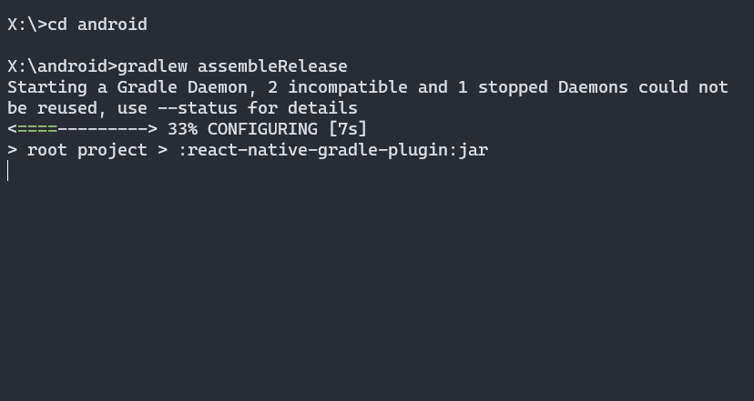
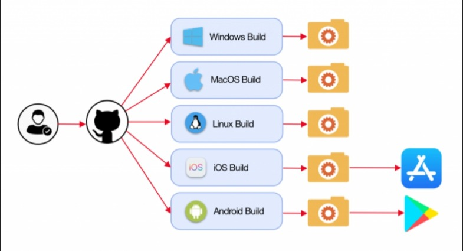

# React Native CI / CD

# Source -> Build -> Test -> Deliver/Deploy
#
#

# CI - Development Focused
  - Developers Commit / Push to the Shared Respository
  - Every Commit triggers a sequence of events: test and/or build
  - Prevents broken code from getting into the codebase
  - Generates an "Artifact" -> APK, IPA, WAR, TAR, EXE ...

# What we need for CI
 - Code:  Developers
 - Version Control System. Git:  GitHub, GitLab, Bitbucket  (not CVS!)
 - Pileline: ( Runner / Orchestration).  Server to perform the CI Tasks:  GitHub Actions, Jenkins, Travis, CircleCI
 - Build/Test Tools:  Npm, Gradle, Java, Maven, Clang.  Usually run Inside Containers
 - Artifact Repository:  Place to put the Artifact.  GitHub, NPM, Yarn, MS AppCenter, Artifactory

#
#
#
#
#
#
#
#
#
#
#

# Continuous Delivery / Deployment

## Post-Development
### App is always ready to be deployed.

## Continuous Delivery
### Intervention is needed to Deploy to production.  This just the result of CI
## Continuous Deployment
### Automatic Deployment to Production. No Intervention

#
#
#
#
#
#
#
#
#
#

# CLI (Command Line) Builds

- Command Line Test
- Command Line Build
- Resulting package can be deployed to a Device or App Store
- Note size difference between RN and Native apk
- CLI Works, but Time Consuming
#
#
#
#
#
#
#
#
#
#

# Github Actions:

  - https://github.com/gary-jipp/demo-react-native-base64/actions
  - Test (node)
  - Can test with multiple node versions
  - Multiple Jobs - eg: test # build
  - Build (android / iOS)
  - Build Status Badges
#
#
#
#
#
#
#
# MS AppCenter

- https://appcenter.ms/
- Easy to use
- SDK / Analytics are optional
- For Android, Need to add JAVA11 environment variable
- JAVA_HOME : $(JAVA_HOME_11_X64)
- iOS Buuild takes a lot longer

## Code Signing
- Android:  Java Keystore
- IOS:
  - Provisioning Profile: apple developer account
  - certificate & key (p12): xcode

## Build status badge
 - can use image or paste markdown

## AppCenter SDK
 - Crash Reporting
 - Analytics
 - Require some minor native code tweaks
 - Optional but useful

## AppCenter API
https://openapi.appcenter.ms/
#
#
key alias: apptest

https://clearbridgemobile.com/how-to-create-a-distribution-provisioning-profile-for-ios/

https://support.magplus.com/hc/en-us/articles/203808748-iOS-Creating-a-Distribution-Certificate-and-p12-File

https://ariya.io/2020/12/continuous-integration-for-react-native-apps-with-github-actions

https://medium.com/@remi.gallego/automate-react-native-builds-with-github-actions-af54212d26dc

https://proandroiddev.com/how-to-securely-build-and-sign-your-android-app-with-github-actions-ad5323452ce
