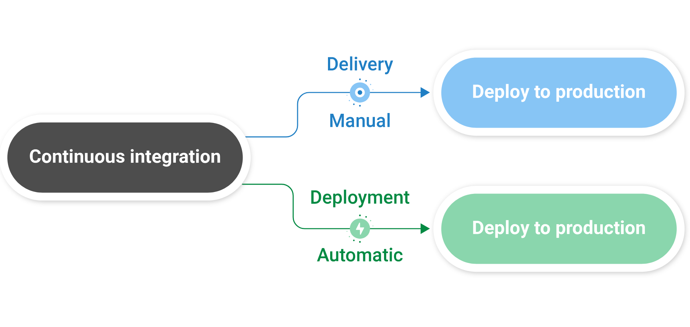

# React Native CI / CD

## Overview
### CI - Development Focused
  - Developers Commit / Push to the Shared Respository
  - Every Commit triggers a sequence of events: test and/or build
  - Prevents broken code from getting into the codebase
  - Generates a Runnable Image APK / IPA

#### What we need for CI
 - Code:  Developers
 - Version Control System. Git:  GitHub, GitLab, Bitbucket, etc (not CVS!)
 - CI Runner for Orchastration.  Server to perform the CI Tasks:  GitHub Actions, Jenkins,
 -

### CD x 2 - Focused on Post-Development

  #### Continuous Delivery
  This just means the App is always ready to be deployed.  Intervention is needed to Deploy to production.  This just the result of CI
  #### Continuous Deployment
    -

- Command Line Test
- Command Line Build
- Resulting package can be deployed to a Device or App Store
- Note size difference between RN and Native apk
- CLI Works, but Time Consuming

- Github Actions:
  - test (node)
  - build (android gradle)
-