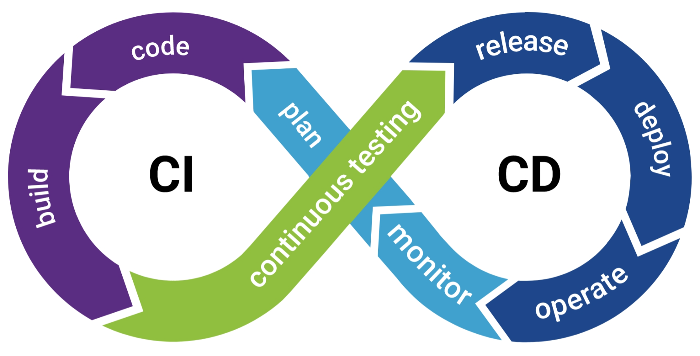
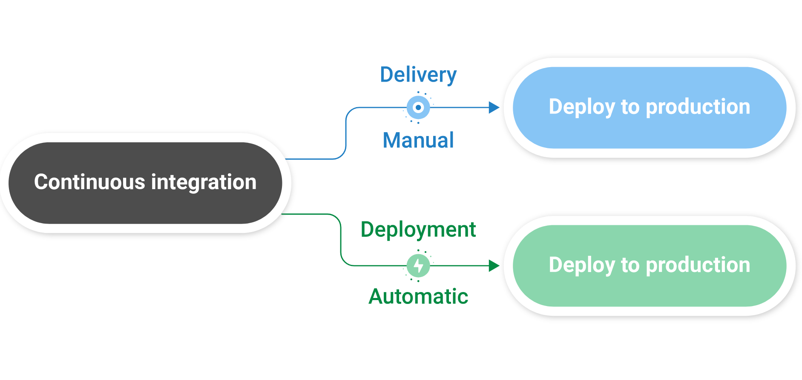
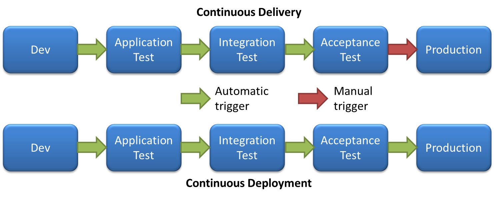

# React Native CI / CD

## Overview
### CI - Development Focused
  - Developers Commit / Push to the Shared Respository
  - Every Commit triggers a sequence of events: test and/or build
  - Prevents broken code from getting into the codebase
  - Generates a Runnable Image APK / IPA

### What we need for CI
 - Code:  Developers
 - Version Control System. Git:  GitHub, GitLab, Bitbucket  (not CVS!)
 - CI Runner for Orchestration.  Server to perform the CI Tasks:  GitHub Actions, Jenkins,
 - Build/Test Tools:  Npm, Gradle, Java, Maven, Clang.  Usually run Inside Containers
 - Artifact Repository:  Place to put the build.  GitHub Packages, MS AppCenter, Artifactory

#
#
#
#
#
#
#
#
#
#
#

## CD x 2 - Focused on Post-Development

## Continuous Delivery
App is always ready to be deployed.  Intervention is needed to Deploy to production.  This just the result of CI
## Continuous Deployment
Automatic Deployment to Production. No Intervention

#
#
#
#
#
#
#
#
#
#

## CIi Build
- Command Line Test
- Command Line Build
- Resulting package can be deployed to a Device or App Store
- Note size difference between RN and Native apk
- CLI Works, but Time Consuming
#
#
#
#
#
#
#
#
#
#

## Github Actions:
  - Test (node)
  - Build (android gradle)
-

https://ariya.io/2020/12/continuous-integration-for-react-native-apps-with-github-actions

https://medium.com/@remi.gallego/automate-react-native-builds-with-github-actions-af54212d26dc